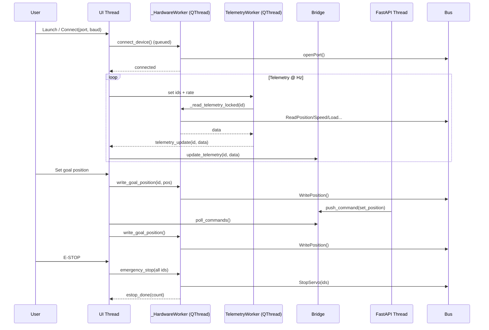
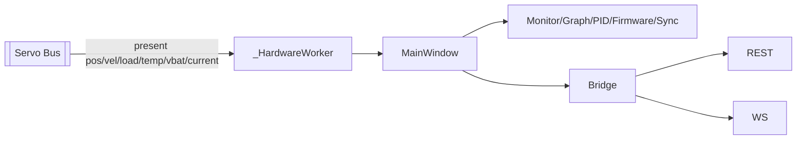

# ServoPilot Architecture

## System Overview
- Desktop Qt app (PySide6) orchestrates UI, status, tabs, docks.
- Dedicated hardware thread (`ServoBackend._HardwareWorker`) serializes all ST3215 bus I/O.
- Separate telemetry thread (`TelemetryWorker`) polls selected servo IDs at configurable Hz.
- Thread-safe bridge (`ApiBridge`) caches telemetry/ids/groups and carries API→UI command queue.
- FastAPI server (daemon thread via uvicorn) exposes REST + WebSocket; it never touches serial, only the bridge.
- Hardware bus is half-duplex USB-Serial to ST3215 servos.

```mermaid
flowchart LR
  subgraph UI[Qt UI (Main Thread)]
    MW[MainWindow\nmenus/status/tabs]
    Tabs[Monitor | Graph | PID | ControlTable | Firmware | Motion | Sync]
    Console[PacketConsole]
  end

  subgraph HWThread[_HardwareWorker (QThread)]
    HW[Serial I/O\nPID/config/motion/sync]
  end

  subgraph TelemetryThread[TelemetryWorker (QThread)]
    TW[Poll selected IDs]
  end

  subgraph Bridge[ApiBridge]
    TelemetryCache[Telemetry cache]
    CmdQueue[Command queue\nAPI→UI]
    Groups[Groups/home/goal]
  end

  subgraph API[FastAPI + Uvicorn]
    REST[REST endpoints]
    WS[WebSocket stream]
  end

  subgraph Bus[ST3215 Servo Bus]
    Servos[ST3215 servos\nUSB-Serial]
  end

  User --> MW
  MW --> Tabs
  MW -->|queued commands| HW
  MW -->|start/stop| TW
  TW -->|read telemetry| HW
  HW -->|telemetry| MW
  HW -->|serial packets| Servos
  MW --> TelemetryCache
  TelemetryCache --> REST
  TelemetryCache --> WS
  API -.->|push| CmdQueue
  MW -->|poll 10Hz| CmdQueue
  MW -->|dispatch| HW
  Groups --> REST
  MW -->|set groups/home| Groups
  HW --> Console
  MW --> Console
```

## Thread & Signal Model


## Data Flow (per telemetry tick)


## Control Paths
- **Local UI**: Tab signals → MainWindow → ServoBackend proxy → _HardwareWorker → Bus.
- **Remote API**: REST/WS → ApiBridge queue → MainWindow 10 Hz poll → ServoBackend → Bus.
- **Sync Move**: Sync tab builds `id→pos` map → ServoBackend `sync_write_positions` → sequential WritePosition with inter-packet delay.
- **Motion Profile**: Motion tab → ServoBackend `execute_motion_profile` → worker-spawned Python thread driving `MoveTo` with stop flag.

## Components & Roles
- MainWindow: assembles UI, owns status bar, timers, API server toggle, polls ApiBridge commands, routes telemetry to tabs and bridge.
- Tabs: emit user intents; render telemetry; enforce UI-side guards (e.g., torque warnings).
- ServoBackend/_HardwareWorker: single point of serial truth; resets port busy flag; wraps ST3215 calls; handles EEPROM unlock/lock; emits all signals.
- TelemetryWorker: periodic, ID-filtered polling with cooperative sleep for low stop latency.
- ApiBridge: lock-protected caches; command queue; groups/home/goal state storage; WebSocket client tracking.
- FastAPI server: stateless façade; validates optional API key; only talks to ApiBridge; never touches Qt or serial.

## API Quick Reference
- REST
  - `GET /servos` → list connected servos + latest telemetry snapshot.
  - `GET /servos/{id}/state` → telemetry for one servo.
  - `POST /servos/{id}/position` `{position, speed?}` → queued set_position.
  - `POST /servos/{id}/torque` `{enable}` → queued torque on/off.
  - `POST /servos/{id}/mode` `{mode: position|wheel|pwm|step}` → queued set_mode.
  - `POST /servos/home` → queued homing.
  - `POST /servos/emergency_stop` → queued estop.
  - `GET /servos/groups` → list configured groups.
  - `POST /servos/groups/{name}/sync_move` `[{id, position}, ...]` → queued sync move.
- WebSocket
  - `/ws/telemetry` streams ~10 Hz JSON: `{timestamp, servos: {"1": {position, velocity, load, voltage, temperature, current}, ...}}`.
  - Client commands over WS: `set_position`, `set_torque`, `home`, `emergency_stop` (all forwarded via bridge queue).

## Typical Sequences
1) **Connect & Scan**
   - UI connect → HW openPort → UI enables E-STOP → UI scan → HW ListServos → UI populates tabs + starts telemetry timer.
2) **Set Goal Position (UI)**
   - User slider → UI write_goal_position → HW WritePosition → Bus executes.
3) **Remote Set Position (API)**
   - REST POST → ApiBridge queue → UI polls → HW WritePosition → Bus.
4) **E-STOP**
   - User button or API → UI clears goals → HW StopServo for all IDs → estop_done → console/status message.

## Safety & Reliability Notes
- All serial I/O is single-threaded in _HardwareWorker to avoid bus contention.
- `portHandler.is_using` is reset before operations to clear stuck COMM_PORT_BUSY.
- EEPROM writes: unlock → write → lock (PID, registers, limits).
- Telemetry thread sleeps in small chunks to allow fast stop.
- API thread is isolated; no Qt calls; only bridge interactions.

## Testing Hooks
- Use `test/` scripts for hardware sanity (ping, telemetry, temperature, motion).
- PacketConsole shows raw TX/RX for debugging protocol issues.

## Example REST Calls (curl)
```bash
# List servos
curl http://localhost:8765/servos

# Move servo 1 to 2200 with speed 800
curl -X POST http://localhost:8765/servos/1/position \
  -H "Content-Type: application/json" \
  -d '{"position":2200,"speed":800}'

# Emergency stop all
curl -X POST http://localhost:8765/servos/emergency_stop
```

## Example WebSocket Snippet (Python)
```python
import asyncio, json, websockets

async def main():
    async with websockets.connect("ws://localhost:8765/ws/telemetry") as ws:
        # send a command
        await ws.send(json.dumps({"command": "set_position", "id": 1, "position": 2100}))
        # read a few telemetry frames
        for _ in range(3):
            msg = await ws.recv()
            print(json.loads(msg))

asyncio.run(main())
```
